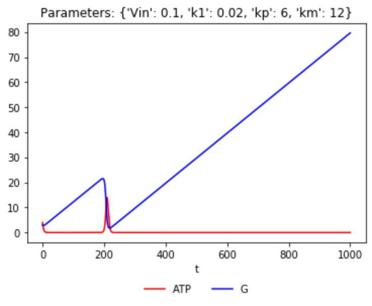
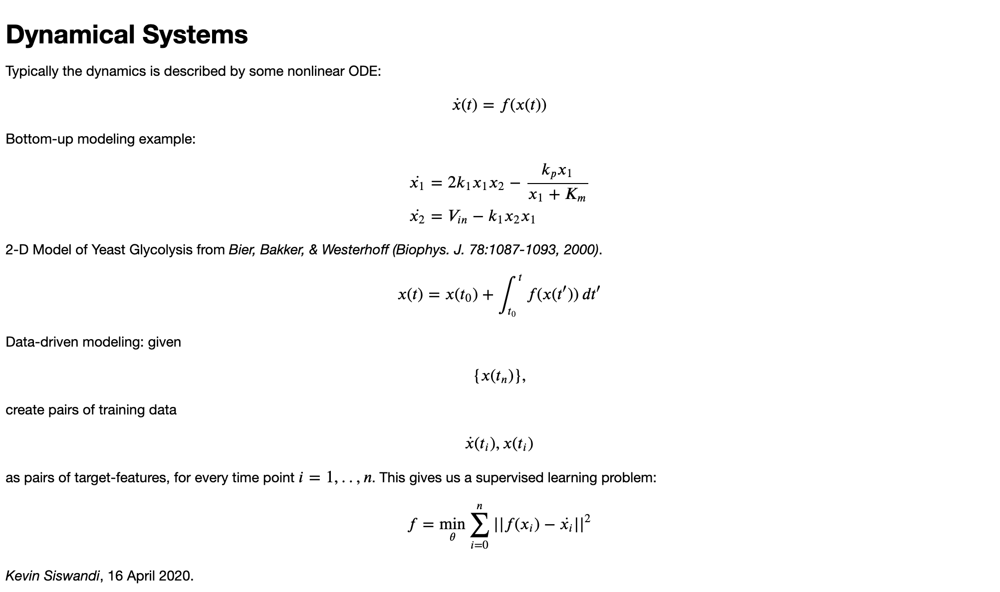
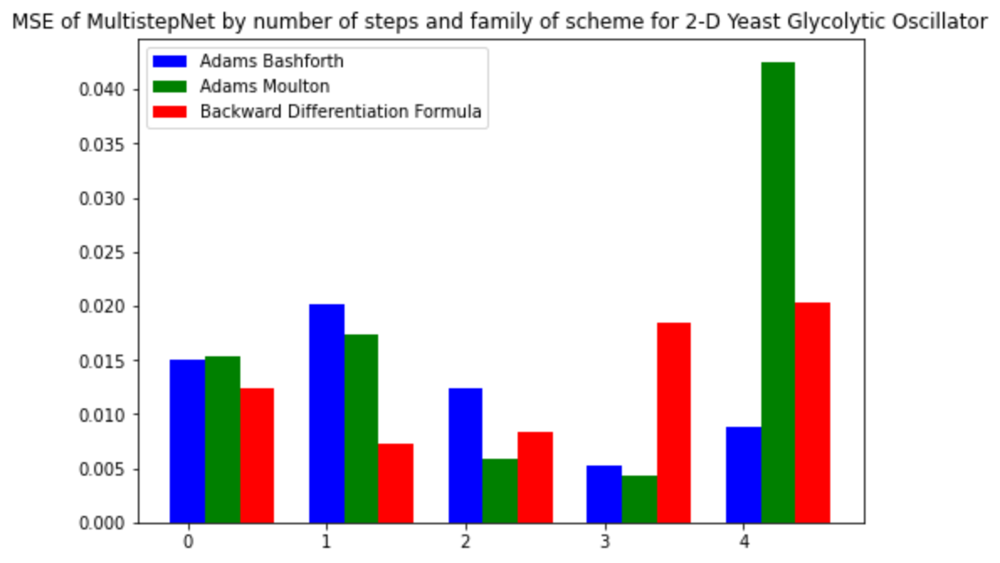
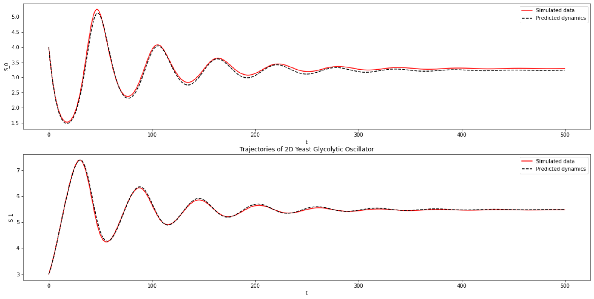
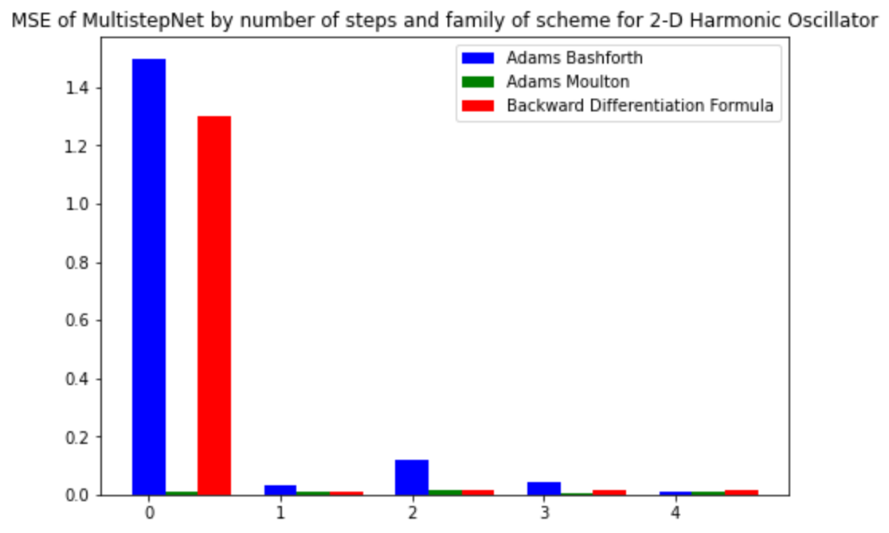

# Machine Learning Engineer Nanodegree
## Capstone Project
Kevin Siswandi  
May 2020

## I. Definition

### Project Overview

In the biosciences, [dynamic modeling](https://en.wikipedia.org/wiki/Dynamical_system) plays a very important role for understanding and predicting the behaviour of biochemical systems, with wide-ranging applications from bioengineering to precision medicine. For instance, understanding how a certain inhibitor affects the enzyme function is useful not just for improving titer, yield, and rate (TRY) in bioengineering, but also for designing personalized drugs. Traditionally, dynamic modeling of biochemical systems is done by painstakingly constructing a set of equations that characterises the system dynamics, which takes a long time to develop and does not scale with increasing amounts of data. To overcome these challenges, I implement a data-driven method based on machine learning that allows faster development of predictive dynamics and improves in performance when more data are available. I am fascinated by the opportunities created by the abundance of data and computing power in bioinformatics and would love to contribute to shaping the future of bioscience with machine learning, one step at a time.

To generate time-series data for training and testing the model, I will simulate time-series concentrations from the [glycolytic oscillations in yeast cells](https://www.ncbi.nlm.nih.gov/pmc/articles/PMC1300712/). This is done by solving the system of equations using a numerical integrator from the open-source `scipy` library.

### Problem Statement

The goal is to create a machine learning approach that can fully characterize how a biochemical system evolves with time. The tasks involved are:
1. Generate time-series data by simulating ATP and Glucose concentrations
2. Build a multistep neural network using TensorFlow that can simulate dynamics after learning from time-series data
3. Train the multistep neural network on the data from yeast glycolysis
4. Evaluate the performance of the method on three regimes of different biological behaviour

The final product is expected to be useful for predicting the dynamics of a complex biochemical system given various initial conditions, which has relevant use cases for bioengineering and precision medicine.

For more details of the potential commercial applications:
- Chubukov, V., Mukhopadhyay, A., Petzold, C. J., Keasling, J. D. & Martn, H. G. Synthetic and systems biology for microbial production of commodity chemicals. NPJ Syst. Biol. Appl. 2, 16009 (2016).
- Chen, R. & Snyder, M. Promise of personalized omics to precision medicine. Wiley Interdiscip. Rev.: Syst. Biol. Med. 5, 73–82 (2013).

### Metrics

Because we are dealing with continuous values, the natural metric to use is the mean squared error (MSE), which is the L2 norm of the discrepancy between predicted and true dynamics.

## II. Analysis

### Data Exploration

I analyze the data that are simulated using the [2-D yeast glycolysis model](https://www.ncbi.nlm.nih.gov/pmc/articles/PMC1300712/). To generate the data, I construct the system of differential equations using three regimes of parameter values:
1. Default regime (resulting in oscillatory behaviour)
2. Damped oscillatory regime
3. Bifurcation regime (the point at which state transition happens)

The resulting data consists of time-series concentrations of ATP and Glucose that mimics the glycolysis pathway in yeast cells. The primary interest of this project is to re-discover the qualitative behaviour of the complex biochemical system using neural network, so I made a detailed analysis in `Analysis - Data Exploration and Visualization`.

In particular, the following findings are important insights:
- The frequency of oscillation of ATP is similar/same as Glucose when sustained oscillations are present
- The system is [bistable](https://en.wikipedia.org/wiki/Bistability) with two possible steady states: a stable fixed point/equilibrium and a stable limit cycle.

### Exploratory Visualization

With the default parameter values, the system exhibits an oscillatory behaviour:

Reducing the glucose transport rate to 0.1, however, results in a very different qualitative behaviour where there is a short burst of ATP followed by linear increase in Glucose:

The bistability in the system is evident from the presence of a stable limit cycle in yet another parameter regime:

To find the point of bifurcation where the state transition occurs, I plot the maximum and minimum values of [G] and [ATP] after a sufficiently long period:

It can be seen from the bifurcation plot that the system changes its qualitative behaviour (from oscillating to a stable fixed point) when the glucose transport rate (Vin) is around 1.3

These visualizations are important because the implementation of the machine learning approach must be able to recover the above dynamic behaviour. Apart from discovering dynamics, it should also correctly identify bifurcation.

Plot Glossary:
- [ATP] = Time-series concentration of Adenosine Triphosphate
- [G] = Time-series concentration of Glucose
- Vin = Initial Glucose transport rate
- k1, kp, km = Parameters of the enzyme kinetics

### Algorithms and Techniques

The objective is to find the function `f` that best represents the dynamics in the data, which is the right hand side of the ordinary differential equations (ODE) in dynamic modeling. This is done by formulating a supervised learning problem embedded in the numerical framework of [linear multistep methods (LMM)](https://en.wikipedia.org/wiki/Linear_multistep_method). Formally, we proceed as follows.

Note the use of the squared error (L2 norm) in the loss function. To solve the optimization problem, I build a [MultiStep Neural Network](https://maziarraissi.github.io/research/7_multistep_neural_networks/) in TensorFlow 2.2, embedded in numerical framework of LMM from [SymPy](https://www.sympy.org/en/index.html). From preliminary experiments, the following hyperparameters are identified to be important/significant for performance:
- step size of the LMM scheme
- the number of steps
- the family of the LMM scheme (either Adams Bashforths, Adams Moulton, or Backward Differentiation Formula)

A more detailed look at the algorithm and the implementation can be found in the notebook `Algorithm - MultistepNet.ipynb`. The algorithm takes time-series data as input and returns the derivatives as output, which can then be integrated using `scipy.odeint` to get the predictions.

### Benchmark

This is the first time the multistep neural network method is applied to the 2-D Yeast Glycolysis problem. Therefore, the performance results of multistep neural network for a similar system (2-D Cubic Oscillator) are used as a benchmark. The benchmark results are taken from [MultiStep Neural Network](https://maziarraissi.github.io/research/7_multistep_neural_networks/), which are empirical MSE (L2 error) between the predicted and exact trajectory.

Note: a related approach is the [implicit SINDy method](https://ieeexplore.ieee.org/stamp/stamp.jsp?arnumber=7809160), which uses LASSO regression to find a sparse representation to a library of candidate functions. However, it assumes prior knowledge about the dynamical systems and requires the user to specify prior candidate functions. Since the method was not applied to the specific problem in this project and is more computationally expensive, it is left as a possibility for future work.

## III. Methodology

### Data Preprocessing

Since I am simulating the data myself, I generate the data such that it is in the form that is suitable for training the multistep neural network. The required steps are:
- define the equations for the ODE model
- specify the parameter values for the ODE model
- solve the ODE to obtain time-series, given initial value
- add Gaussian noise into the data (optional)
- reshape the array into 1 x array.shape[0] x array.shape[1]. This is necessary because the multistep neural network is written to be able to handle multiple trajectories (my future work -- in this project I deal only with 1 trajectory).
- transform the values into tensor with type `tf.float32`

During inference, the data must be reshaped to get rid of the redundant dimension via `np.squeeze()`.

### Implementation

I design a custom model using the TensorFlow subclassing API. The Neural Network model class is defined in `model.py`, while the function to generate output is defined in `predict.py` and the training of the multistep neural network is implemented in the Python script `train.py`. All nontrivial methods and classes are documented with docstrings and comments.

The overall implementation consists of the following steps:
1. Generation of training and test data via `bier(...)` function
2. Construction of the Multistep Neural Network via the `lmmNet(...)` class:
  - load LMM coefficients from `nodepy` according to the family of LMM scheme
  - arrange the coefficients to conform with equation (2) in [MultiStep Neural Network](https://maziarraissi.github.io/research/7_multistep_neural_networks/)
  - define a feed-forward neural network with one hidden layer (tanh activation function)
  - implement the linear difference operator for LMM in the `get_Y(...)` method (see, for example, Chapter 5 in [Numerical Analysis of ODE](https://www.mathsim.eu/~gkanscha/notes/ode.pdf))
  - implement the function `get_F(...)` that gives the output of the neural network and is used by the linear difference operator
  - define the `train(...)` function
  - define the `predict(...)` function -- this function (in `model.py`) is then used by `predict.py` to make predictions by numerical integration
3. Implementation of the metrics MSE (L2-error) using `numpy.linalg.norm` function in the `compute_MSE` function (accessible in the notebook `Benchmark - 2D Cubic Oscillator`).

The implementation of the multistep neural network takes the step size, number of steps, and the family scheme as input arguments. This is an important design choice because the best parameter set may be problem-dependent. The performance results for different settings of the hyperparameters are reported in section 4.

**Remark**: in the future, the number of hidden layers can be tuned to get a better performance, but for now I use a single layer to get a working implementation.

### Refinement
In this section, you will need to discuss the process of improvement you made upon the algorithms and techniques you used in your implementation. For example, adjusting parameters for certain models to acquire improved solutions would fall under the refinement category. Your initial and final solutions should be reported, as well as any significant intermediate results as necessary. Questions to ask yourself when writing this section:
- _Has an initial solution been found and clearly reported?_
- _Is the process of improvement clearly documented, such as what techniques were used?_
- _Are intermediate and final solutions clearly reported as the process is improved?_

## IV. Results

### Model Evaluation and Validation

In order to evaluate the model against the benchmark, I make an extensive report on the MSE results for different number of steps (M = 1, 2, 3, 4, and 5) and family of LMM scheme:

The results show that using the Adams Bashforths scheme with M = 3 gives the lowest MSE (best performance). Therefore, this setting is selected as the final model to evaluate on the test data:

The final model is able to predict the dynamics of the test data fairly well in both species (Glucose and ATP). Plotting this in the phase space, the convergence to a stable limit cycle can be clearly seen:

 In addition, some type of analysis should be used to validate the robustness of this model and its solution, such as manipulating the input data or environment to see how the model’s solution is affected (this is called sensitivity analysis).
- _Has the final model been tested with various inputs to evaluate whether the model generalizes well to unseen data?_
- _Is the model robust enough for the problem? Do small perturbations (changes) in training data or the input space greatly affect the results?_
- _Can results found from the model be trusted?_

### Justification

In comparison to the results presented in the previous section, the MSE for the 2-D Harmonic Oscillator, as reported in [MultiStep Neural Network](https://maziarraissi.github.io/research/7_multistep_neural_networks/), show significantly worse performance when using single step for AB and BDF:

In [MultiStep Neural Network](https://maziarraissi.github.io/research/7_multistep_neural_networks/), it was hypothesized that the superior performance of the Adams Moulton scheme may be due to the arrangement of the terms in the trapezoidal rule. However, we see that this is not the case here for the 2-D Yeast Glycolytic Oscillator. This exciting result should motivate further study in this area to investigate the mathematical properties of the method (in a [recent paper](https://arxiv.org/abs/1912.12728), it has been shown that the Multistep Neural Network is **not stable** for M > 1 in the Adams-Moulton scheme).

In this section, your model’s final solution and its results should be compared to the benchmark you established earlier in the project using some type of statistical analysis. You should also justify whether these results and the solution are significant enough to have solved the problem posed in the project. Questions to ask yourself when writing this section:
- _Are the final results found stronger than the benchmark result reported earlier?_
- _Have you thoroughly analyzed and discussed the final solution?_
- _Is the final solution significant enough to have solved the problem?_

## V. Conclusion
_(approx. 1-2 pages)_

### Free-Form Visualization
In this section, you will need to provide some form of visualization that emphasizes an important quality about the project. It is much more free-form, but should reasonably support a significant result or characteristic about the problem that you want to discuss. Questions to ask yourself when writing this section:
- _Have you visualized a relevant or important quality about the problem, dataset, input data, or results?_
- _Is the visualization thoroughly analyzed and discussed?_
- _If a plot is provided, are the axes, title, and datum clearly defined?_

### Reflection
In this section, you will summarize the entire end-to-end problem solution and discuss one or two particular aspects of the project you found interesting or difficult. You are expected to reflect on the project as a whole to show that you have a firm understanding of the entire process employed in your work. Questions to ask yourself when writing this section:
- _Have you thoroughly summarized the entire process you used for this project?_
- _Were there any interesting aspects of the project?_
- _Were there any difficult aspects of the project?_
- _Does the final model and solution fit your expectations for the problem, and should it be used in a general setting to solve these types of problems?_

### Improvement
In this section, you will need to provide discussion as to how one aspect of the implementation you designed could be improved. As an example, consider ways your implementation can be made more general, and what would need to be modified. You do not need to make this improvement, but the potential solutions resulting from these changes are considered and compared/contrasted to your current solution. Questions to ask yourself when writing this section:
- _Are there further improvements that could be made on the algorithms or techniques you used in this project?_
- _Were there algorithms or techniques you researched that you did not know how to implement, but would consider using if you knew how?_
- _If you used your final solution as the new benchmark, do you think an even better solution exists?_

-----------

**Before submitting, ask yourself. . .**

- Is each section (particularly **Analysis** and **Methodology**) written in a clear, concise and specific fashion? Are there any ambiguous terms or phrases that need clarification?
- Would the intended audience of your project be able to understand your analysis, methods, and results?
- Have you properly proof-read your project report to assure there are minimal grammatical and spelling mistakes?
- Are all the resources used for this project correctly cited and referenced?
- Is the code that implements your solution easily readable and properly commented?
- Does the code execute without error and produce results similar to those reported?
